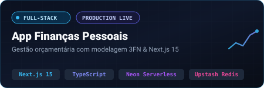
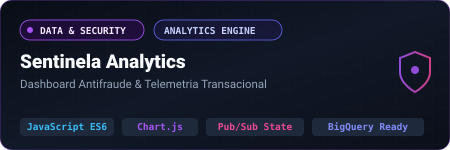
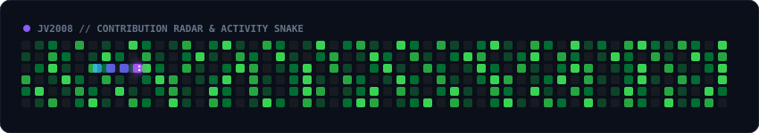

<!-- HERO BANNER -->

 

<!-- ORIGINAL DUAL-LANGUAGE TAGLINE -->

  <b>🇧🇷 Engenharia de software do core ao deploy: construindo aplicações web escaláveis, APIs robustas e soluções analíticas da modelagem relacional à IA aplicada.</b>
   
  <b>🇺🇸 Software engineering from core to deploy: building scalable web applications, robust APIs, and data-driven systems from relational modeling to applied AI.</b>

<!-- QUICK NAVIGATION -->

  <a href="#-sobre-mim--about-me"><code>Sobre Mim / About</code></a> •
  <a href="#-vitrine-de-projetos--featured-projects"><code>Projetos / Projects</code></a> •
  <a href="#-stack-tecnol%C3%B3gica--tech-stack"><code>Tech Stack</code></a> •
  <a href="#-linha-do-tempo--technical-journey"><code>Evolução / Journey</code></a> •
  <a href="#-estat%C3%ADsticas--github-analytics"><code>Stats</code></a> •
  <a href="#-contato--get-in-touch"><code>Contato / Contact</code></a>

---

### 👨‍💻 Sobre Mim / About Me

<table width="100%" border="0">
<tr>
<td width="50%" valign="top">

#### 🇧🇷 Português
Olá! Sou **João Victor**, desenvolvedor de software focado na construção de sistemas web modernos, APIs resilientes e arquiteturas orientadas a dados.

* 🎯 **Foco de Atuação**: Desenvolvimento Full-Stack com **Next.js**, **TypeScript**, ecossistema **.NET (C#)** e **Java**, integrando bancos relacionais e nuvem.
* 🏗️ **Arquitetura & Qualidade**: Modelagem relacional estrita (3FN), separação limpa de camadas (Service & Repository pattern), autenticação segura (JWT, NextAuth, BCrypt) e rate limiting.
* 📊 **Dados & Nuvem**: Experiência prática com **GCP** (BigQuery, Dataflow, Dataform), **Neon Database Serverless**, **PostgreSQL** e deploys contínuos via **Vercel** e **Render**.
* 🤖 **Inovação Contínua**: Exploração ativa de orquestração de **agentes autônomos de IA** e consumo analítico de telemetria.

</td>
<td width="50%" valign="top">

#### 🇺🇸 English
Hello! I am **João Victor**, a software engineer dedicated to crafting performant web applications, resilient backend APIs, and data-driven architectures.

* 🎯 **Core Focus**: Full-Stack engineering leveraging **Next.js**, **TypeScript**, **.NET (C#)**, and **Java**, bridged with cloud data pipelines.
* 🏗️ **Architecture & Integrity**: Rigorous relational modeling (3NF), decoupled business logic (Service/Repository layers), secure auth (JWT, NextAuth, BCrypt), and API rate limiting.
* 📊 **Cloud & Data**: Hands-on workflow with **Google Cloud Platform** (BigQuery, Dataflow, Dataform), **Neon Serverless PostgreSQL**, and automated CI/CD across **Vercel** & **Render**.
* 🤖 **Continuous Growth**: Building modular **AI agent orchestration** APIs and high-volume transactional fraud analytics.

</td>
</tr>
</table>

---

### 🚀 Vitrine de Projetos / Featured Projects

Projetos reais, com código auditável, arquitetura deliberada e deploys públicos em produção.

 

#### 1. 💰 App de Finanças Pessoais — *Full-Stack SaaS Platform*
> **Substituição de planilhas financeiras por uma plataforma web completa em produção com modelagem 3FN.**

  

* **🇧🇷 Problema & Solução**: Sistema criado para substituir controles manuais via Excel por um painel analítico com autenticação, gestão multi-contas, transações em tempo real e gráficos de evolução orçamentária.
* **🇺🇸 Architecture Highlights**:
  * **Core Stack**: `Next.js 15 (App Router)` · `React 18` · `TypeScript` · `Tailwind CSS` · `Recharts`
  * **Database & Integrity**: **PostgreSQL** via **Neon Database Serverless** com schema normalizado em **3FN** — saldo derivado matematicamente do histórico imutável de transações (sem inconsistência de cache).
  * **Security & Performance**: Rate limiting distribuído com **Upstash Redis** (`@upstash/ratelimit`), autenticação via **NextAuth** com hash **BCrypt**.
* **Status**: 🟢 Em produção ativa com dual-deploy.
* **Links**: [📂 Repositório GitHub](https://github.com/JV2008/app-financa-pessoal) • [🌐 Live Demo (Vercel)](https://app-financa-pessoal-eight.vercel.app) • [⚙️ API Service (Render)](https://app-financa-pessoal.onrender.com)

---

#### 2. 🛡️ Sentinela Analytics — *Dashboard Antifraude & Telemetria*
> **Painel transacional para monitoramento de risco e cibersegurança com visualização analítica interativa.**

  

* **🇧🇷 Problema & Solução**: Interface analítica desenhada para equipes de prevenção a fraudes em pagamentos. Processa KPIs de volume transacionado, score de risco e distribuição temporal de incidentes.
* **🇺🇸 Architecture Highlights**:
  * **Core Stack**: `JavaScript (ES6+ Vanilla)` · `Chart.js` · `CSS Tokens` · `Pub/Sub State Management`
  * **Arquitetura Desacoplada**: Implementação estrita do padrão de serviço (`dataService.js`). A interface consome contratos padronizados (`/dashboard`), permitindo migração imediata de mock sintético determinístico para queries de Data Warehouses analíticos (**Google BigQuery** / Snowflake).
  * **Interatividade Avançada**: Seleção de período por *brushing* no gráfico temporal (arrastar de mouse), rankings paginados por MCC, Estabelecimento e Emissor.
* **Status**: 🟢 Protótipo Arquitetural Funcional (Zero-build / Clean Vanilla ES6)
* **Links**: [📂 Repositório GitHub](https://github.com/JV2008/frontend-developer-portfolio) • [🖼️ Visualizar Screenshot do Dashboard](https://github.com/JV2008/frontend-developer-portfolio/blob/main/Sentinela%20Analytics%20Dashboard%20Antifraude%20-%20Cyberseguran%C3%A7a%20%26%20Dados.png)

---

<table width="100%" border="0">
<tr>
<td width="50%" valign="top">

#### 3. 🤖 API Agents — *AI Agents Orchestration*
API RESTful modular voltada para criação, teste e orquestração de agentes autônomos inteligentes integrados a LLMs.

* **Stack**: `Python` · `Flask` · `REST API` · `Agentic Workflows`
* **Diferenciais**:
  * Isolamento modular de agentes especialistas (`agent-math`)
  * Endpoint REST `/chat` com suporte a execução determinística
  * Arquitetura extensível para acoplamento de novos agentes e ferramentas
* **Status**: 🛠️ Ativo & Experimental
* **Acesso**: [📂 Explorar Código no GitHub](https://github.com/JV2008/API_Agents)

</td>
<td width="50%" valign="top">

#### 4. ⚡ CadastroDotNet Web API — *.NET 10 Core*
API corporativa construída com .NET de última geração e persistência em banco relacional PostgreSQL.

* **Stack**: `C#` · `.NET 10` · `Entity Framework Core` · `PostgreSQL (Npgsql)`
* **Diferenciais**:
  * Autenticação e autorização via `JwtBearer`
  * Criptografia e segurança de credenciais com `BCrypt.Net`
  * Documentação interativa integrada com `Swagger / OpenAPI`
  * Mapeamento objeto-relacional robusto com EF Core Migrations
* **Status**: 🟢 Concluído
* **Acesso**: [📂 Explorar Código no GitHub](https://github.com/JV2008/cadastroDotNet)

</td>
</tr>
<tr>
<td width="50%" valign="top">

#### 5. 📦 SENAI Notes REST API & Backend
Microsserviço de gestão de dados com integração frontend e pipeline de entrega automatizada.

* **Stack**: `Node.js` · `Express.js` · `CORS` · `Render CI/CD`
* **Diferenciais**:
  * Operações CRUD completas com tratamento de erros
  * Documentação formal de contratos no Postman (`docs_Postman`)
  * Deploy contínuo automatizado no Render
* **Status**: 🟢 Deploy Ativo
* **Acesso**: [📂 Repositório](https://github.com/JV2008/senai-frameworks-frontend-api-backend) • [🚀 Live API (Render)](https://senai-frameworks-frontend-api-backend.onrender.com/api/notes)

</td>
<td width="50%" valign="top">

#### 6. 🎨 Digital Atelier — *Mobile-First Landing Page*
Projeto de curadoria e experiência visual premium desenvolvido sob metodologia Mobile First.

* **Stack**: `HTML5 Semântico` · `CSS3 Flexbox/Grid` · `Design System`
* **Diferenciais**:
  * Responsividade pixel-perfect sem dependência de frameworks pesados
  * Foco em branding refinado, microinterações e hierarquia tipográfica
  * Carregamento ultrarrápido com zero tempo de compilação
* **Status**: 🟢 Concluído
* **Acesso**: [📂 Explorar Código no GitHub](https://github.com/JV2008/DigitalAtilier)

</td>
</tr>
</table>

---

### 🛠️ Stack Tecnológica / Tech Stack

Tecnologias comprovadas no histórico de repositórios e projetos ativos.

#### Frontend & UI Engineering

  
  
  
  
  
  
  

#### Backend & APIs

  
  
  
  
  
  
  

#### Bancos de Dados & Cache

  
  
  
  
  

#### Cloud, Data & Infraestrutura

  
  
  
  
  
  

#### Ferramentas & Engenharia

  
  
  
  
  

---

### 📈 Linha do Tempo & Evolução Técnica / Technical Journey

Visualização animada e verificada dos marcos de desenvolvimento registrados no GitHub de 2024 até o presente.

  

 

<b>🔍 Detalhamento das Fases de Evolução (Clique para expandir)</b>

 

* **Fase 1 (Fev/2024 – Jun/2024) — Fundamentos & Lógica**: Domínio de estruturas condicionais, vetores, matrizes, coleções e lógica computacional em Java (`primeiro-projeto-git`, `Estruturas-Condicionais`, `Matriz`, `Arraylist`).
* **Fase 2 (Jul/2024 – Dez/2024) — POO Avançada & Modelagem Relacional**: Aplicação de herança, polimorfismo, interfaces e abstrações em Java (`Arena_dos_Herois`, `POO-encapsulamento`), aliada à modelagem de tabelas e queries SQL relacionais.
* **Fase 3 (Jan/2025 – Jun/2025) — Persistência Corporativa & Mobile**: Mapeamento objeto-relacional com JPA / Hibernate em bancos MySQL (`JPAAluno`, `JPAProduto`, `carrojpa`) e introdução ao desenvolvimento mobile com Dart/Flutter (`PDMaula1`).
* **Fase 4 (Jul/2025 – Mar/2026) — Ecossistema Web Moderno & APIs C# .NET**: Criação de APIs robustas com ASP.NET Core e Entity Framework no .NET 10 (`cadastroDotNet`), aliadas ao frontend reativo com Next.js, React e Tailwind CSS.
* **Fase 5 (2026 – Presente) — Produção em Nuvem, IA Aplicada & Analytics**: Lançamento de aplicações completas com banco serverless Neon 3FN, rate limiting via Redis, telemetria analítica com contratos para Data Warehouses (`Sentinela Analytics`), deploys em Vercel e Render e orquestração de agentes de IA (`API_Agents`).

---

### 🐍 Radar de Contribuições / Contribution Activity

  
  
<i>Atualizado automaticamente via GitHub Actions com pipeline agendado diário.</i>

---

### 📊 Estatísticas / GitHub Analytics

<table border="0">
<tr>
<td align="center" valign="middle">
  
</td>
<td align="center" valign="middle">
  
</td>
</tr>
<tr>
<td colspan="2" align="center">
  
</td>
</tr>
</table>

---

### 📬 Contato & Conecte-se / Get In Touch

Estou aberto a oportunidades profissionais, desafios de engenharia e trocas sobre tecnologia. Vamos conversar!

  
  &nbsp;
  
  &nbsp;
  

  ⚡ <i>"Autenticidade técnica e código construído com propósito."</i> • <b>João Victor (JV2008)</b>

